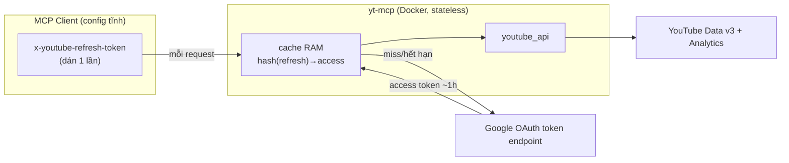

# Thiết kế yt-mcp: giữ kiến trúc stateless của Facebook MCP khi auth phức tạp hơn

> Luận điểm: dựng YouTube MCP **full tính năng** mà **vẫn giữ ADN stateless-header**
> của Facebook MCP — mấu chốt là để **client giữ refresh token**, server chỉ **đổi
> refresh→access và cache theo `sha256(refresh_token)`**, không persist gì.

## Bối cảnh

Tham khảo repo TS [maagpi-youtube-mcp](https://github.com/vamsi-kodimela/maagpi-youtube-mcp)
nhưng theo kiến trúc Facebook MCP đã có.

ADN cần giữ của Facebook MCP:
- 3 lớp mỏng: `server.py` → `manager.py` → `*_api.py`.
- Stateless HTTP (`streamable-http`, `stateless_http=True`), Docker trên LAN/Tailscale.
- Không giữ secret: credentials do client gửi theo từng request qua header.

Xung đột cốt lõi: Facebook dùng 1 page token dài hạn nhét query param. YouTube:
đọc công khai cần API key; mọi thao tác ghi + Analytics + dữ liệu riêng tư **bắt buộc
OAuth 2.0**, access token **hết hạn ~1h**. Repo TS lưu refresh token theo profile →
phá vỡ stateless. Bài toán: giữ stateless mà vẫn full tính năng.

## Các quyết định thiết kế

### 1. Credentials — OAuth, client giữ refresh token

Chỉ OAuth (bỏ API key — OAuth đọc luôn được dữ liệu công khai).

- MCP client chỉ nhét header tĩnh, không chạy được vòng refresh mỗi giờ.
- ⇒ Client không thể gửi access token (chết sau 1h) → phải giữ & gửi **refresh token**.
- ⇒ **Server** đổi `refresh → access`, cache RAM ~1h. Server **không persist token**.



### 2. Cache đa-tenant — key bằng hash(refresh token)

Server không cần biết "client nào". Mỗi request tự khai báo bằng refresh token mang
theo. Cache là memoize của phép đổi refresh→access, index bằng `sha256(refresh_token)`:

```
cache = { sha256(refresh_token) → (access_token, hạn) }
```

Access token sinh từ đúng refresh token đó, mà key tra cứu chính là credential người
gọi → A không thể chạm token B (muốn chạm ô B phải biết refresh_B — biết thì đã là B).
Không rò chéo, không session, không user-id.

- Key là hash (không log token thô).
- Đua request cùng token → cùng miss → vô hại.
- Nhiều worker → mỗi worker cache riêng → chỉ tốn thêm refresh, vẫn đúng.

### 3. Lấy token — trang `/auth` server-host qua Tailscale HTTPS (zero-install)

Ràng buộc: client không cài gì. Tận dụng server đã là HTTP + Tailscale cấp HTTPS thật:

1. User mở browser → `https://<host>.<tailnet>.ts.net/auth`.
2. Redirect sang Google consent (redirect_uri = host Tailscale `/auth/callback`).
3. Google trả `code` → server đổi `code → refresh_token`.
4. Server **hiển thị refresh_token ra trang** để copy. Không lưu → vẫn stateless.

### 4. client_id / client_secret — trong env server

Để host `/auth`, server giữ `GOOGLE_CLIENT_ID` + `GOOGLE_CLIENT_SECRET` (secret mức
app, không phải mức user). Đổi lại header client gọn: chỉ `x-youtube-refresh-token`.

### 5. Kiểu OAuth app — External + In production (unverified)

Trạng thái publish quyết định số phận refresh token:
- **Testing** → refresh token chết sau 7 ngày. ❌
- **In production** (kể cả chưa verify) → refresh token không hết hạn. ✅ Giá: 1 lần
  bấm qua cảnh báo "unverified app", cap 100 user.
- **Internal** (Workspace) không dùng được với gmail cá nhân.

Scope YouTube là "sensitive" (không phải "restricted" ngặt như Gmail) nên
unverified-production dùng cá nhân ổn.

### 6. Phạm vi tool — bỏ nhóm account (server không lưu profile)

Bỏ 4 tool `account_add/list/switch/remove` vì server không lưu profile → vô nghĩa:
- "thêm account" = chạy `/auth`; "đổi account" = client gửi refresh token khác;
  "liệt kê/xoá" = không có kho server-side; "whoami" = `youtube_channel_get(mine)`.

Đa kênh = client khai báo nhiều kết nối, mỗi cái 1 refresh token.

### 7. Upload — nhận địa chỉ (không nhét bytes qua MCP), async job

Kênh MCP chỉ chở text nhỏ → không đẩy được bytes file GB. `youtube_video_upload` nhận
con trỏ, server tự lấy bytes + resumable upload. `source` nhận 3 dạng:

| Nguồn file | `source` | Đường bytes tới server |
|---|---|---|
| File client-local | id (từ `/upload`) | trang `/upload` (kéo-thả / `curl -F`) |
| File có URL | `https://.../video.mp4` | server tự tải |
| File trên máy chủ | `/data/video.mp4` (mount) | đọc thẳng đĩa |

File lớn upload lâu → **async job**: trả `job_id`, poll `youtube_upload_status`. File
client-local luôn 2 bước (đẩy file → gọi tool) — giá bất khả kháng khi server ở xa.

### 8. Thư viện — chính thức của Google

`google-api-python-client` + `google-auth` (+ `google-auth-oauthlib`) lo resumable
upload, refresh token, retry, service `youtubeAnalytics`. Kiến trúc 3 lớp giữ nguyên,
chỉ thay ruột lớp `api`.

### 9. Chống chịu — giữ retry + structured errors

Bỏ caching (mâu thuẫn stateless/đa-tenant, quản lý cần dữ liệu tươi) và quota-tracking
(không nâng trần).

## Ràng buộc đã biết & chấp nhận

- **Quota dùng chung**: 1 OAuth app = 10.000 unit/ngày cho mọi client (upload=1.600/lần
  → ~6 upload/ngày toàn hệ thống). Chạm trần thì xin Google nâng quota.
- Upload file client-local luôn 2 bước.
- 1 lần bấm qua cảnh báo "unverified app" lúc consent.
- Job upload in-memory → mất khi restart.

## Kiến trúc file

```
server.py       → khai báo @mcp.tool() (passthrough mỏng)
manager.py      → điều phối, ráp tham số
youtube_api.py  → Data API v3 + Analytics (google lib)
auth.py         → refresh→access + cache theo hash(refresh token)
jobs.py         → upload async in-memory
web.py          → route /auth, /auth/callback, /upload
config.py       → scope + hằng số
run_http.py     → streamable-http (stateless) + gắn route web
```

## Kết luận

Lõi chi phối: **đẩy việc giữ token về phía client, biến server thành bộ đổi-token
stateless keyed-by-credential**. Nhờ đó đạt full tính năng của repo TS *và* giữ trọn
kiến trúc stateless-đa-tenant-không-secret của Facebook MCP. Các phần "lệch" (OAuth,
`/auth`, `/upload`, async job) đều là hệ quả tất yếu của việc YouTube API phức tạp hơn.
